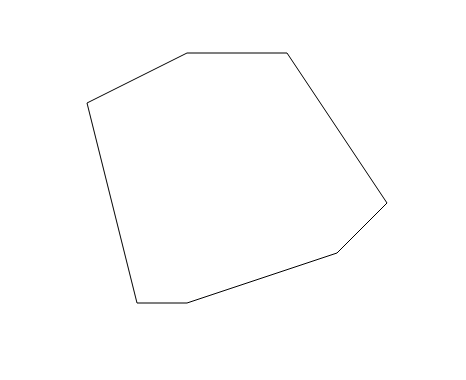
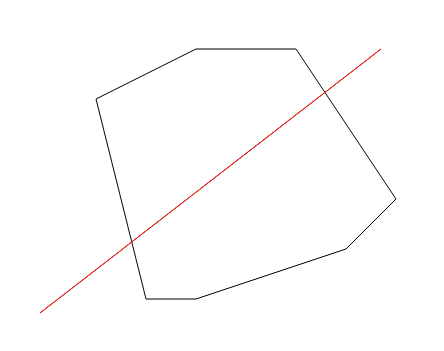
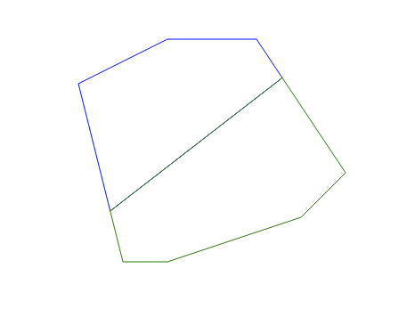

### Task

The goal of this exercise is to take a polygon defined by the points 'points', use the mouse events to draw a line that will split the polygon and then draw the two split polygons.

In the start, you'll have the initial polygon.

While dragging the mouse, the polygon should be shown along with the line you're drawing.
After letting go of the mouse, the polygon will be split into two along that line. 
